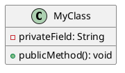
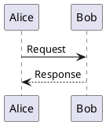
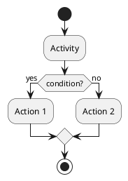
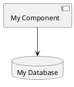

# Quick Start Guide - System Design Visualization

Get started with the system design documentation in 5 minutes.

## 🚀 Quick Navigation

### 📖 Want to understand the system?
**Start here:** [README.md](README.md)
- High-level overview
- Key features
- Technology stack

### 🎯 Want to see the architecture?
**View diagrams:** [docs/INDEX.md](docs/INDEX.md)
- Complete diagram catalog
- All UML diagrams with descriptions
- Compilation instructions

### 🤖 Want to understand the AI agents?
**Read this:** [docs/agents/AGENTIC_ARCHITECTURE.md](docs/agents/AGENTIC_ARCHITECTURE.md)
- 10 specialized AI agents
- Agent capabilities and tools
- Coordination patterns

### 🏗️ Want comprehensive design details?
**Study this:** [docs/SYSTEM_DESIGN_GUIDE.md](docs/SYSTEM_DESIGN_GUIDE.md)
- Complete system design
- Architecture patterns
- Design decisions

## 📊 Diagram Quick Reference

### Essential Diagrams (Start Here)

#### 1. **Component Diagram** - System Overview
```bash
# View the compiled image
open docs/uml/ComponentDiagram.png

# Or compile from source
plantuml -tpng docs/uml/component_diagram.puml
```
**Shows:** How all AWS services connect together

#### 2. **Sequence Diagram: RAG Flow** - How AI Works
```bash
open docs/uml/RAGProcessingSequence.png
```
**Shows:** How the system generates intelligent responses

#### 3. **State Diagram** - Ticket Lifecycle
```bash
open docs/uml/TicketLifecycleState.png
```
**Shows:** All states a ticket can be in

### Advanced Diagrams

#### 4. **Class Diagram** - System Structure
```bash
open docs/uml/ClassDiagram.png
```
**Shows:** All components and their relationships

#### 5. **Activity Diagram: Ticket Processing** - Business Flow
```bash
open docs/uml/TicketProcessingActivity.png
```
**Shows:** Decision logic and process flow

#### 6. **Deployment Diagram** - AWS Infrastructure
```bash
open docs/uml/DeploymentDiagram.png
```
**Shows:** Physical deployment on AWS

## 🛠️ Working with PlantUML

### Installation (One-time Setup)

**Ubuntu/Debian:**
```bash
sudo apt-get install plantuml graphviz
```

**macOS:**
```bash
brew install plantuml
```

**Docker (No installation needed):**
```bash
# Use Docker to compile diagrams
docker pull plantuml/plantuml:latest
```

### Compilation Commands

**Compile all diagrams:**
```bash
cd /path/to/project
plantuml -tpng docs/uml/*.puml
```

**Compile specific diagram:**
```bash
plantuml -tpng docs/uml/class_diagram.puml
```

**Generate SVG (scalable):**
```bash
plantuml -tsvg docs/uml/*.puml
```

**Using Docker:**
```bash
docker run -v $(pwd):/data plantuml/plantuml:latest -tpng /data/docs/uml/*.puml
```

### View Generated Images

All PNG files are already generated in `docs/uml/`:
```bash
# List all diagrams
ls -lh docs/uml/*.png

# Open a specific diagram
open docs/uml/ClassDiagram.png
# or on Linux: xdg-open docs/uml/ClassDiagram.png
```

## 📁 Project Structure

```
Cloud-Intelligent-Jira-Ticket-Resolution-System/
├── README.md                          # Project overview
├── QUICK_START.md                     # This file
├── .gitignore                         # Git ignore rules
│
└── docs/
    ├── INDEX.md                       # Documentation index
    ├── SYSTEM_DESIGN_GUIDE.md        # Comprehensive design guide
    │
    ├── agents/
    │   └── AGENTIC_ARCHITECTURE.md   # Multi-agent AI system
    │
    ├── architecture/                  # (Reserved for future)
    │
    └── uml/
        ├── *.puml                     # PlantUML source files (11 files)
        ├── *.png                      # Generated diagrams (11 images)
        ├── CLASS_DIAGRAM.md           # Class diagram documentation
        ├── SEQUENCE_DIAGRAMS.md       # Sequence diagrams documentation
        ├── ACTIVITY_DIAGRAMS.md       # Activity diagrams documentation
        ├── COMPONENT_DIAGRAM.md       # Component diagram documentation
        ├── STATE_DIAGRAM.md           # State diagram documentation
        └── DEPLOYMENT_DIAGRAM.md      # Deployment diagram documentation
```

## 🎯 Common Tasks

### Task 1: View All Diagrams
```bash
# Open the folder with all generated PNGs
cd docs/uml && open .
# or on Linux: cd docs/uml && xdg-open .
```

### Task 2: Regenerate All Diagrams
```bash
cd /path/to/project
plantuml -tpng docs/uml/*.puml
```

### Task 3: Edit a Diagram
```bash
# 1. Open the .puml file in your editor
vim docs/uml/class_diagram.puml

# 2. Make changes (add components, update relationships, etc.)

# 3. Recompile
plantuml -tpng docs/uml/class_diagram.puml

# 4. View updated image
open docs/uml/ClassDiagram.png
```

### Task 4: Create a New Diagram
```bash
# 1. Create a new .puml file
cat > docs/uml/my_diagram.puml << 'EOF'
@startuml MyDiagram
title My New Diagram

class MyClass {
    +myMethod()
}

@enduml
EOF

# 2. Compile it
plantuml -tpng docs/uml/my_diagram.puml

# 3. View it
open docs/uml/MyDiagram.png
```

## 📚 Learning Path

### Beginner (30 minutes)
1. **Read:** [README.md](README.md) - 5 min
2. **View:** Component Diagram - 10 min
3. **View:** State Diagram - 10 min
4. **Scan:** [docs/INDEX.md](docs/INDEX.md) - 5 min

### Intermediate (2 hours)
1. **Read:** All diagram documentation - 30 min
2. **View:** All sequence diagrams - 20 min
3. **View:** All activity diagrams - 20 min
4. **Read:** [AGENTIC_ARCHITECTURE.md](docs/agents/AGENTIC_ARCHITECTURE.md) - 40 min

### Advanced (4 hours)
1. **Study:** Class Diagram in detail - 60 min
2. **Study:** Deployment Diagram - 40 min
3. **Read:** [SYSTEM_DESIGN_GUIDE.md](docs/SYSTEM_DESIGN_GUIDE.md) - 90 min
4. **Review:** All PlantUML sources - 30 min

## 🔍 Finding Information

### I want to know...

**"How does the AI generate responses?"**
→ Read: [Sequence Diagram: RAG Processing](docs/uml/SEQUENCE_DIAGRAMS.md#2-rag-retrieval-augmented-generation-flow)

**"What are all the AI agents?"**
→ Read: [Agentic Architecture](docs/agents/AGENTIC_ARCHITECTURE.md)

**"How does a ticket flow through the system?"**
→ View: [Activity Diagram: Ticket Processing](docs/uml/TicketProcessingActivity.png)

**"What AWS services are used?"**
→ View: [Component Diagram](docs/uml/ComponentDiagram.png)

**"How is the infrastructure deployed?"**
→ View: [Deployment Diagram](docs/uml/DeploymentDiagram.png)

**"What states can a ticket be in?"**
→ View: [State Diagram](docs/uml/TicketLifecycleState.png)

**"How does CI/CD work?"**
→ View: [Activity Diagram: CI/CD](docs/uml/CICDPipeline.png)

**"How does the system learn and improve?"**
→ View: [Sequence Diagram: MLOps](docs/uml/FeedbackAndRetrainingPipeline.png)

## 💡 Tips

### For Visual Learners
Start with the diagrams, then read the documentation.

### For Technical Readers
Read the documentation first, then verify with diagrams.

### For Architects
Focus on Component and Deployment diagrams first.

### For Developers
Focus on Class and Sequence diagrams first.

### For Data Scientists
Focus on Agent Architecture and MLOps diagrams.

## 🎓 PlantUML Syntax Basics

### Class Diagram


### Sequence Diagram


### Activity Diagram


### Component Diagram


### State Diagram


## 🔗 External Resources

- [PlantUML Official Documentation](https://plantuml.com/)
- [PlantUML Cheat Sheet](https://plantuml.com/guide)
- [AWS Architecture Icons](https://aws.amazon.com/architecture/icons/)
- [UML Tutorial](https://www.uml-diagrams.org/)

## ❓ FAQ

**Q: Do I need to install PlantUML?**
A: Only if you want to modify and recompile diagrams. All PNG images are already generated.

**Q: Can I edit the diagrams?**
A: Yes! Edit the `.puml` files and recompile.

**Q: What format are the diagrams?**
A: PlantUML text format (.puml) that compiles to PNG/SVG.

**Q: Can I use these diagrams in presentations?**
A: Yes! PNG and SVG formats work in PowerPoint, Google Slides, etc.

**Q: Are the diagrams up to date?**
A: Yes, last updated: 2024-11-13

**Q: Can I generate PDF versions?**
A: Yes: `plantuml -tpdf docs/uml/*.puml`

## 🎯 Next Steps

1. ✅ Read this Quick Start
2. ✅ View 3 essential diagrams
3. ✅ Read the main README
4. ✅ Explore the documentation index
5. ✅ Dive deep into areas of interest

## 📞 Support

For questions or issues:
1. Check the [INDEX.md](docs/INDEX.md)
2. Review relevant diagram documentation
3. Consult [SYSTEM_DESIGN_GUIDE.md](docs/SYSTEM_DESIGN_GUIDE.md)

---

**Happy exploring! 🚀**

This system represents a modern, scalable, and intelligent approach to automated technical support. The comprehensive documentation and diagrams provide everything you need to understand, implement, and extend the system.
