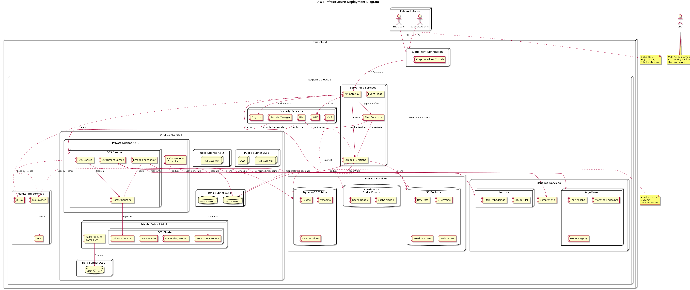

# Deployment Diagram - AWS Infrastructure

This deployment diagram shows the physical deployment architecture on AWS infrastructure.

## Compilation Instructions

```bash
# Compile the deployment diagram
plantuml -tpng docs/uml/deployment_diagram.puml
```

## AWS Infrastructure Deployment

**Source:** [deployment_diagram.puml](deployment_diagram.puml)

**Generated Image:** 

## Infrastructure Overview

### AWS Region: us-east-1
Primary deployment region with multi-AZ configuration for high availability.

---

## Network Architecture

### VPC Configuration
- **CIDR Block:** 10.0.0.0/16
- **Availability Zones:** 2 (AZ-1, AZ-2)
- **Subnets:** 6 (2 public, 2 private, 2 data)

#### Public Subnets (10.0.1.0/24, 10.0.2.0/24)
**Purpose:** Internet-facing components

Components:
- **NAT Gateways:** One per AZ for outbound internet access
- **Application Load Balancer (ALB):** Distributes traffic to ECS services

**Features:**
- Internet Gateway attachment
- Route to 0.0.0.0/0
- Elastic IPs for NAT

#### Private Subnets (10.0.10.0/24, 10.0.11.0/24)
**Purpose:** Application tier

Components:
- **ECS Clusters:** Container orchestration
  - Enrichment Service containers
  - Embedding Worker containers
  - RAG Service containers
  - Qdrant Vector DB containers
- **EC2 Instances:** Kafka producers (t3.medium)

**Features:**
- No direct internet access
- NAT Gateway for outbound
- Security Group isolation
- Private DNS

#### Data Subnets (10.0.20.0/24, 10.0.21.0/24)
**Purpose:** Data layer

Components:
- **Amazon MSK:** Kafka broker cluster (3 brokers)
- **RDS Instances:** Relational database (if needed)

**Features:**
- Isolated from application tier
- Separate security groups
- Encryption at rest
- Automated backups

---

## Compute Services

### ECS Fargate Clusters
**Configuration:**
- **Cluster Size:** Auto-scaling (2-10 tasks)
- **Task CPU:** 2 vCPU
- **Task Memory:** 4 GB
- **Networking:** awsvpc mode

**Services:**

#### 1. Enrichment Service
- **Containers:** 2-6 tasks
- **Port:** 8080
- **Health Check:** /health endpoint
- **Auto-scaling Trigger:** CPU > 70%

#### 2. Embedding Worker
- **Containers:** 2-8 tasks
- **Port:** 8081
- **Health Check:** /ready endpoint
- **Auto-scaling Trigger:** Queue depth

#### 3. RAG Service
- **Containers:** 2-6 tasks
- **Port:** 8082
- **Health Check:** /health endpoint
- **Auto-scaling Trigger:** Request rate

#### 4. Qdrant Vector DB
- **Containers:** 2 tasks (primary + replica)
- **Port:** 6333
- **Persistence:** EBS volumes
- **Replication:** Cross-AZ

### Lambda Functions
**Configuration:**
- **Runtime:** Python 3.11, Node.js 18
- **Memory:** 512 MB - 3 GB
- **Timeout:** 30 seconds - 15 minutes
- **Concurrency:** Reserved (100) + burst

**Functions:**
- Ticket Controllers (REST API handlers)
- Response Controllers
- Workflow orchestration
- Data transformation

### EC2 Instances (Kafka Producers)
**Configuration:**
- **Instance Type:** t3.medium
- **OS:** Amazon Linux 2
- **Storage:** 100 GB gp3
- **Auto-scaling:** 2-4 instances

---

## Managed Services

### Amazon MSK (Kafka)
**Configuration:**
- **Brokers:** 3 (kafka.m5.large)
- **Storage:** 1 TB per broker
- **Replication Factor:** 3
- **Partitions:** 12 per topic

**Topics:**
- `tickets.raw` (3 partitions)
- `tickets.enriched` (6 partitions)
- `tickets.embedded` (6 partitions)

### Amazon SageMaker
**Deployment:**
- **Training Jobs:** On-demand p3.2xlarge
- **Inference Endpoints:** 
  - Embedding: 2x ml.g4dn.xlarge
  - LLM: 2x ml.g5.2xlarge
- **Model Registry:** Versioned models
- **Auto-scaling:** Based on invocations

### Amazon Bedrock
**Configuration:**
- **Models:** Claude, Titan Embeddings
- **Throughput:** Provisioned (1000 TPM)
- **Fallback:** Retry with exponential backoff

---

## Storage Services

### S3 Buckets
**Configuration:**
- **Versioning:** Enabled
- **Encryption:** AES-256 (SSE-S3)
- **Lifecycle:** Transition to Glacier after 90 days
- **Replication:** Cross-region (us-west-2)

**Buckets:**
1. **tickets-raw-data** (Standard → IA → Glacier)
2. **ml-artifacts** (Standard, versioned)
3. **feedback-data** (Standard → IA)
4. **web-assets** (Standard, CloudFront origin)

### DynamoDB Tables
**Configuration:**
- **Billing:** On-demand
- **Encryption:** AWS-managed CMK
- **Backup:** Point-in-time recovery
- **Global Tables:** Optional for DR

**Tables:**
1. **Tickets** (Hash: ticket_id)
2. **TicketMetadata** (Hash: ticket_id)
3. **UserSessions** (Hash: session_id, TTL enabled)

### ElastiCache Redis
**Configuration:**
- **Node Type:** cache.r6g.large
- **Cluster:** 2 nodes (primary + replica)
- **Mode:** Cluster mode disabled
- **Encryption:** In-transit and at-rest

---

## Security Services

### AWS IAM
**Roles:**
- **ECS Task Execution Role:** Pull images, write logs
- **ECS Task Role:** Access S3, DynamoDB, SageMaker
- **Lambda Execution Role:** Service-specific permissions
- **SageMaker Execution Role:** Training and inference

### AWS Cognito
**Configuration:**
- **User Pool:** Email/password authentication
- **MFA:** Optional TOTP
- **Password Policy:** Strong requirements
- **Federation:** Optional SAML/OIDC

### AWS Secrets Manager
**Secrets:**
- Database credentials
- API keys (external services)
- Encryption keys
- Service tokens

**Rotation:** Automatic (30 days)

### AWS KMS
**Keys:**
- **S3 Encryption:** Customer-managed CMK
- **DynamoDB:** AWS-managed key
- **Secrets:** Dedicated CMK

### AWS WAF
**Rules:**
- Rate limiting (1000 req/5min per IP)
- Geo-blocking (optional)
- SQL injection protection
- XSS protection

---

## Monitoring Services

### CloudWatch
**Configuration:**
- **Log Groups:** Per service (30-day retention)
- **Metrics:** Custom + AWS metrics
- **Dashboards:** Real-time monitoring
- **Alarms:** 50+ alarms configured

**Key Metrics:**
- ECS CPU/Memory utilization
- Lambda invocations and errors
- API Gateway latency
- DynamoDB throttles
- S3 requests and errors

### X-Ray
**Tracing:**
- API Gateway → Lambda → DynamoDB
- ECS services inter-communication
- SageMaker inference calls
- External API calls

**Sampling:** 10% of requests

### SNS Topics
**Notifications:**
- **Critical Alerts:** PagerDuty integration
- **Warnings:** Slack channel
- **Info:** Email distribution list

---

## Content Delivery

### CloudFront Distribution
**Configuration:**
- **Price Class:** All edge locations
- **Origin:** S3 bucket (web assets)
- **Secondary Origin:** API Gateway
- **SSL:** ACM certificate (*.example.com)
- **Caching:** Default 24 hours
- **Compression:** Enabled (gzip, brotli)

**Behaviors:**
- `/api/*` → API Gateway (no cache)
- `/static/*` → S3 (long cache)
- `/*` → S3 (default)

---

## High Availability Architecture

### Multi-AZ Deployment
✅ ECS tasks in both AZs
✅ MSK brokers across AZs
✅ DynamoDB automatic multi-AZ
✅ ElastiCache replica in different AZ
✅ ALB cross-zone load balancing

### Auto-Scaling
✅ ECS service auto-scaling
✅ Lambda concurrent execution auto-scaling
✅ DynamoDB on-demand scaling
✅ SageMaker endpoint auto-scaling

### Disaster Recovery
✅ S3 cross-region replication
✅ DynamoDB point-in-time recovery
✅ RDS automated backups
✅ Infrastructure as Code (Terraform)
✅ Runbook documented

**RTO:** 1 hour
**RPO:** 15 minutes

---

## Network Flow

### Inbound Traffic
```
Users → Route 53 → CloudFront → 
  → S3 (static) OR
  → WAF → API Gateway → Lambda/ECS
```

### Internal Traffic
```
ECS Services ↔ MSK ↔ ECS Services
ECS Services → DynamoDB/S3
ECS Services → SageMaker Endpoints
Lambda → Step Functions → Lambda
```

### Outbound Traffic
```
ECS Services → NAT Gateway → Internet Gateway → External APIs
```

---

## Cost Optimization

### Strategies
1. **Spot Instances:** For non-critical workloads
2. **Savings Plans:** For ECS and Lambda
3. **S3 Lifecycle:** Transition to cheaper storage
4. **DynamoDB:** On-demand for variable load
5. **CloudWatch:** Log retention policies
6. **CloudFront:** Caching to reduce origin hits

### Estimated Monthly Cost
- **Compute (ECS + Lambda):** $800
- **Storage (S3 + DynamoDB):** $300
- **Networking (Data Transfer + CloudFront):** $200
- **AI/ML (SageMaker + Bedrock):** $1500
- **Managed Services (MSK + others):** $400
- **Total:** ~$3200/month

---

## Compiling the Diagram

```bash
# Generate PNG
plantuml -tpng docs/uml/deployment_diagram.puml

# Generate SVG (scalable)
plantuml -tsvg docs/uml/deployment_diagram.puml

# Generate both formats
plantuml -tpng -tsvg docs/uml/deployment_diagram.puml
```

This deployment diagram provides a complete view of the physical infrastructure, networking, and service deployment on AWS.
