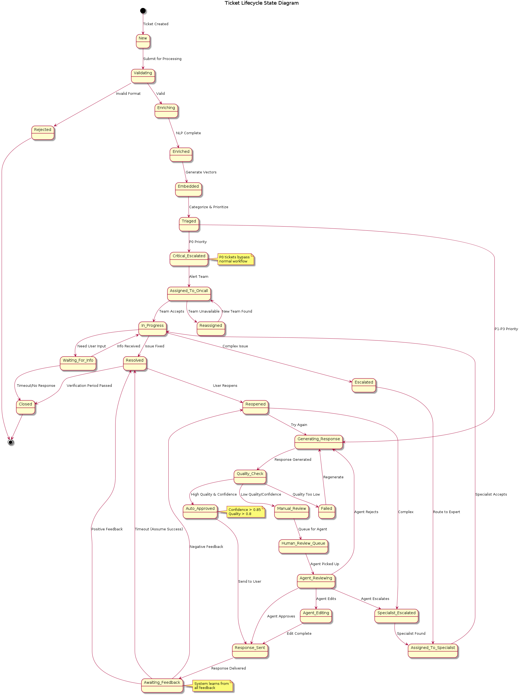

# State Diagram - Ticket Lifecycle

This state diagram shows all possible states a ticket can go through from creation to closure.

## Compilation Instructions

```bash
# Compile the state diagram
plantuml -tpng docs/uml/state_diagram.puml
```

## Ticket Lifecycle State Machine

**Source:** [state_diagram.puml](state_diagram.puml)

**Generated Image:** 

## State Descriptions

### Initial States

#### New
- **Entry:** Ticket is created and submitted
- **Description:** Initial state for all tickets
- **Transitions:** → Validating

#### Validating
- **Description:** Format and content validation
- **Transitions:** 
  - → Rejected (invalid format)
  - → Enriching (valid ticket)

#### Rejected
- **Description:** Terminal state for invalid tickets
- **Actions:** Log error, notify submitter
- **Transitions:** → [Terminal]

---

### Processing States

#### Enriching
- **Description:** NLP processing and metadata extraction
- **Actions:** 
  - Language detection
  - Keyword extraction
  - Sentiment analysis
- **Transitions:** → Enriched

#### Enriched
- **Description:** Ticket has been enriched with metadata
- **Actions:** Store in S3 and DynamoDB
- **Transitions:** → Embedded

#### Embedded
- **Description:** Vector embeddings generated
- **Actions:** Index in vector store
- **Transitions:** → Triaged

#### Triaged
- **Description:** Ticket categorized and prioritized
- **Decision Point:** Priority level determines next state
- **Transitions:** 
  - → Critical_Escalated (P0)
  - → Generating_Response (P1-P3)

---

### Critical Path States (P0)

#### Critical_Escalated
- **Description:** P0 critical tickets bypass normal workflow
- **Actions:** Alert on-call team, create incident
- **Transitions:** → Assigned_To_Oncall

#### Assigned_To_Oncall
- **Description:** Waiting for on-call team acceptance
- **Transitions:** 
  - → In_Progress (team accepts)
  - → Reassigned (team unavailable)

#### Reassigned
- **Description:** Searching for alternative team
- **Actions:** Find backup team, update routing
- **Transitions:** → Assigned_To_Oncall

---

### Standard Path States (P1-P3)

#### Generating_Response
- **Description:** RAG pipeline generating response
- **Actions:** 
  - Embed query
  - Retrieve similar tickets
  - Generate LLM response
- **Transitions:** → Quality_Check

#### Quality_Check
- **Description:** Validating response quality
- **Actions:** 
  - Check completeness
  - Verify factuality
  - Calculate confidence score
- **Transitions:** 
  - → Auto_Approved (high quality & confidence)
  - → Manual_Review (low quality/confidence)
  - → Failed (quality too low)

#### Failed
- **Description:** Response generation failed
- **Actions:** Log failure, update metrics
- **Transitions:** → Generating_Response (regenerate)

#### Auto_Approved
- **Description:** Response meets auto-approval criteria
- **Criteria:** Confidence > 0.85 AND Quality > 0.8
- **Transitions:** → Response_Sent

#### Manual_Review
- **Description:** Response needs human review
- **Actions:** Queue for agent dashboard
- **Transitions:** → Human_Review_Queue

---

### Human Review States

#### Human_Review_Queue
- **Description:** Waiting for agent to pick up
- **Actions:** Display in dashboard, track wait time
- **Transitions:** → Agent_Reviewing

#### Agent_Reviewing
- **Description:** Human agent actively reviewing
- **Actions:** Agent examines response and context
- **Transitions:** 
  - → Response_Sent (agent approves)
  - → Agent_Editing (agent edits)
  - → Generating_Response (agent rejects)
  - → Specialist_Escalated (agent escalates)

#### Agent_Editing
- **Description:** Agent making corrections
- **Actions:** Modify response, add notes
- **Transitions:** → Response_Sent

---

### Response and Feedback States

#### Response_Sent
- **Description:** Response delivered to user
- **Actions:** Send email/notification, log interaction
- **Transitions:** → Awaiting_Feedback

#### Awaiting_Feedback
- **Description:** Waiting for user feedback
- **Timeout:** 48 hours (configurable)
- **Transitions:** 
  - → Resolved (positive feedback)
  - → Reopened (negative feedback)
  - → Resolved (timeout, assume success)

---

### Active Work States

#### In_Progress
- **Description:** Ticket actively being worked on
- **Actions:** Regular status updates
- **Transitions:** 
  - → Waiting_For_Info (need user input)
  - → Resolved (issue fixed)
  - → Escalated (complex issue)

#### Waiting_For_Info
- **Description:** Blocked waiting for user information
- **Timeout:** 7 days
- **Transitions:** 
  - → In_Progress (info received)
  - → Closed (timeout/no response)

---

### Escalation States

#### Escalated
- **Description:** Complex issue requiring specialist
- **Actions:** Route to domain expert
- **Transitions:** → Assigned_To_Specialist

#### Specialist_Escalated
- **Description:** Agent escalated to specialist
- **Actions:** Find expert, transfer context
- **Transitions:** → Assigned_To_Specialist

#### Assigned_To_Specialist
- **Description:** Assigned to domain specialist
- **Actions:** Notify specialist, transfer ownership
- **Transitions:** → In_Progress

---

### Resolution States

#### Reopened
- **Description:** User not satisfied with resolution
- **Actions:** Analyze feedback, increase priority
- **Transitions:** 
  - → Generating_Response (try again)
  - → Specialist_Escalated (too complex)

#### Resolved
- **Description:** Issue successfully resolved
- **Actions:** Close ticket, collect feedback
- **Verification Period:** 24-48 hours
- **Transitions:** 
  - → Closed (verification passed)
  - → Reopened (user reopens)

#### Closed
- **Description:** Terminal state - ticket completed
- **Actions:** Archive data, update analytics
- **Transitions:** → [Terminal]

---

## State Transition Rules

### Auto-Approval Criteria
```
Confidence Score > 0.85 AND
Quality Score > 0.8 AND
No Security Flags AND
Within SLA Bounds
```

### Escalation Criteria
```
Priority = P0 OR
Complexity Score > 0.7 OR
Multiple Failed Attempts OR
Agent Manually Escalates
```

### Timeout Rules
- **Awaiting_Feedback:** 48 hours → Resolved
- **Waiting_For_Info:** 7 days → Closed
- **Agent_Reviewing:** 4 hours → Re-queue

---

## State Metrics

### Average Time in State
- **Enriching:** 2-3 seconds
- **Generating_Response:** 5-8 seconds
- **Quality_Check:** 1-2 seconds
- **Agent_Reviewing:** 15-30 minutes
- **Awaiting_Feedback:** 6-24 hours

### State Distribution (Target)
- **Auto_Approved:** 70%
- **Manual_Review:** 20%
- **Escalated:** 10%

### Transition Success Rates
- **Quality_Check → Auto_Approved:** 70%
- **Agent_Reviewing → Response_Sent:** 85%
- **Awaiting_Feedback → Resolved:** 90%

---

## Special Paths

### Fast Path (Auto-Resolution)
```
New → Validating → Enriching → Enriched → Embedded → 
Triaged → Generating_Response → Quality_Check → 
Auto_Approved → Response_Sent → Awaiting_Feedback → Resolved → Closed
```
**Target Time:** < 30 seconds

### Critical Path (P0)
```
New → Validating → Enriching → Enriched → Embedded → 
Triaged → Critical_Escalated → Assigned_To_Oncall → In_Progress → Resolved → Closed
```
**Target Time:** < 4 hours

### Complex Path (Specialist)
```
New → ... → Triaged → Generating_Response → Quality_Check → 
Manual_Review → Agent_Reviewing → Specialist_Escalated → 
Assigned_To_Specialist → In_Progress → Resolved → Closed
```
**Target Time:** < 48 hours

---

## Compiling the Diagram

```bash
# Generate PNG
plantuml -tpng docs/uml/state_diagram.puml

# Generate SVG
plantuml -tsvg docs/uml/state_diagram.puml

# View the diagram
plantuml docs/uml/state_diagram.puml && open TicketLifecycleState.png
```

This state diagram provides a complete view of all possible ticket states and transitions, helping understand the ticket lifecycle from creation to closure.
